## Minecraft Teleporter

Dieses plugin wurde mit der Entwicklungsumgebung [IntelliJ](https://www.jetbrains.com/idea/download)
der Firma JetBrains geschrieben. [IntelliJ](https://www.jetbrains.com/idea/download) unterstützt die
Entwicklung von Minecraft Plugins sehr gut.

#### Vorbereitungen

Zuerst ist es notwending die Entwicklungsumgebung [herunterzuladen]((https://www.jetbrains.com/idea/download)) und zu installieren. Bitte verwendet
hierfür die "Community Edition". Wenn das geschehen ist, bitte das Modul für Minecraft hinzufügen.

Dafür bitte unter "File" -> "Settings" die Einstellungen öffnen und danach "Plugins" klicken.

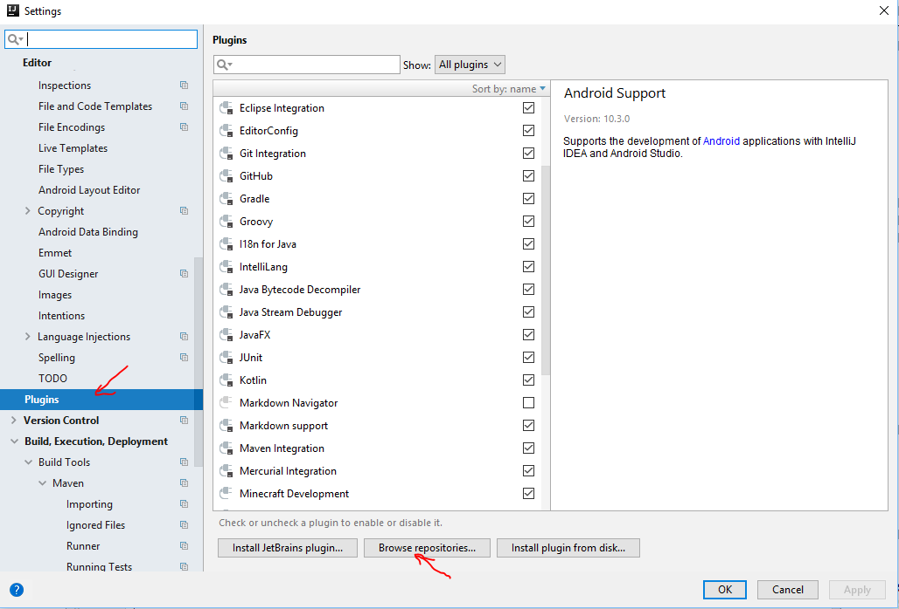

Danach könnt ihr mit "Browse repositories" und dem Suchfeld nach "Minecraft" suchen.

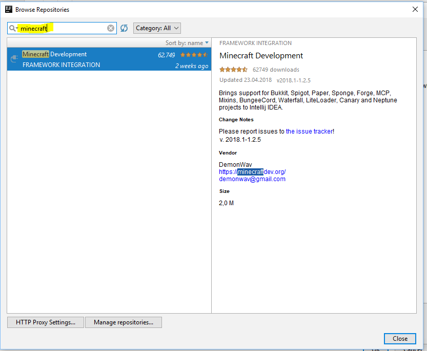

Ein Klick auf "Install" startet den Installationsvorgang (die Schaltfläche ist unter dem Titel und auf dem Bild leider nicht zu sehen).

#### Neues Projekt anlegen

Im Menü "File" -> "New" könnt ihr nun ein neues Minecraft Projet starten. 

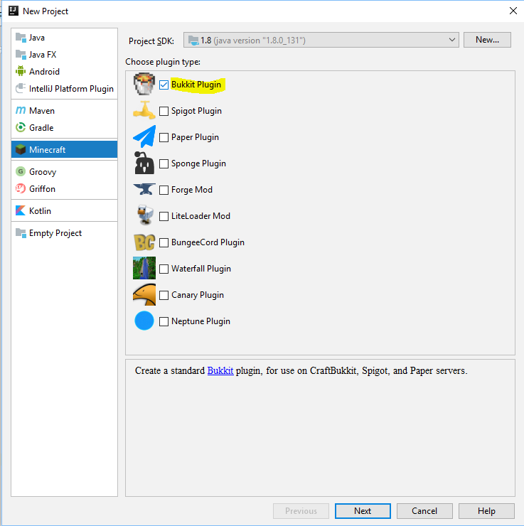

Bitte hier den passenden Minecraft Server (Bukkit) anhaken und auf "Next" klicken.

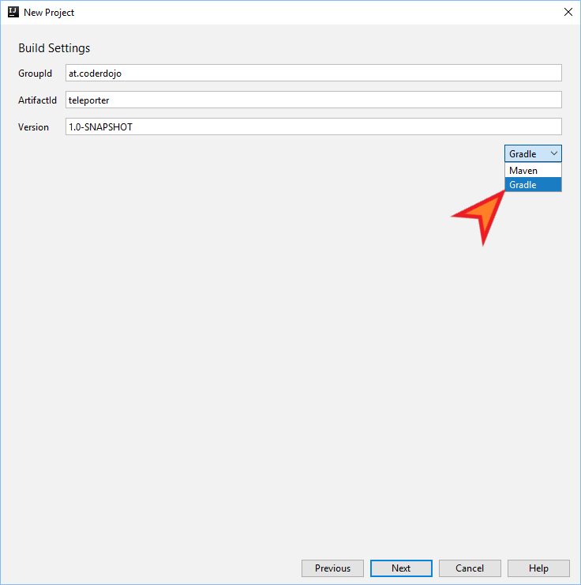

Wir verwenden zum bauen des Plugins das "Gradle" - System. Die Werte für GroupId und ArtifactId sind momentan beliebig.
Mit "Next" gehts weiter.

Anschließend geben wir dem Plugin noch einen Namen und eine Beschreibung. Main Class Name ist der Name der Java-Klasse in die wir die funktionen unseres
Plugins coden werden.
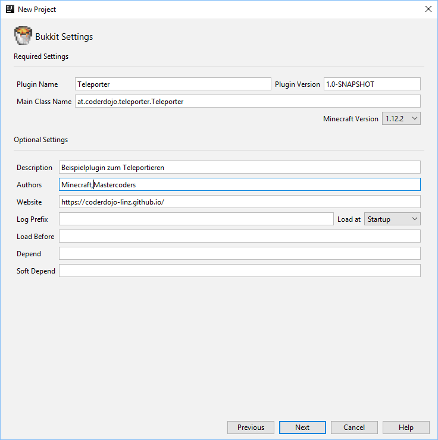

Danach erhält das Projekt noch einen Namen und wir legen fest, wo der Code gespeichert werden soll.
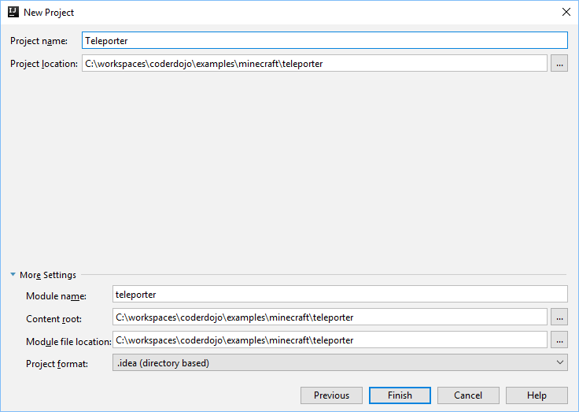

Mit einem kurzen Klick auf "Finish" wird unser Projekt angelegt. Bitte kurz Geduld. Der Vorgang kann schon mal 1-2 Minuten dauern.

#### Erstes Command

Wenn alle Schritte oben erfogreich waren, sollte euer Bildschirm nachher in etwa so aussehen:
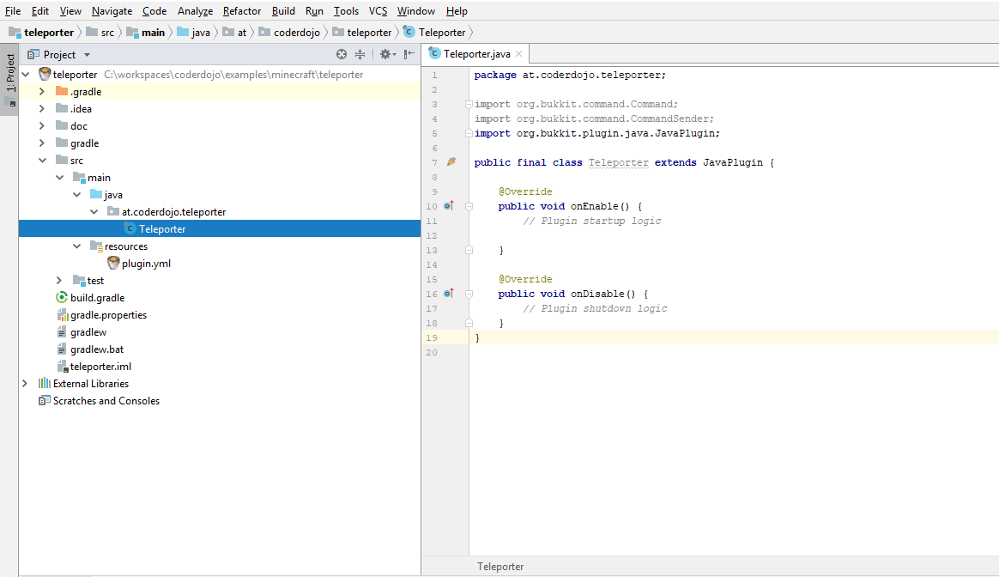

Die wichtisten Dateien am Anfang sind 

1. **plugin.yml** - sie enthält die Beschreibung der Befehle die das Plugin können soll und
2. **Teleporter.java** - Wird im IntellJ nur als "Teleporter" angezeigt. Sie enthält den Code für die Aktionen.

Zuerst werden wir ein neues Kommando implementieren:
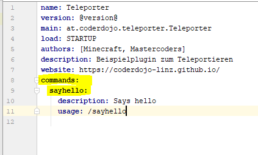

Damit wird festegelegt dass dieses Kommando von unserem Plugin behandelt wird. Nun müssen wir noch dafür sorgen, dass es auch behandelt wird:
Dazu öffnen wir die Klasse Teleporter und fügen "onCommand" ein. (ein druck auf <strng> und die Leertaste machen das viel einfacher).

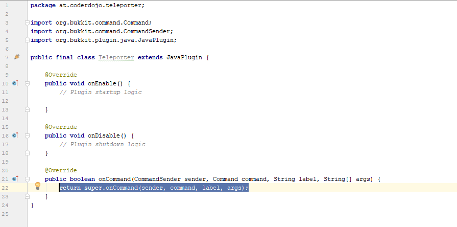

Danach sorgen wir dafür, dass auch etwas passiert, wenn jemand "/sayhello" in den chat tippt.

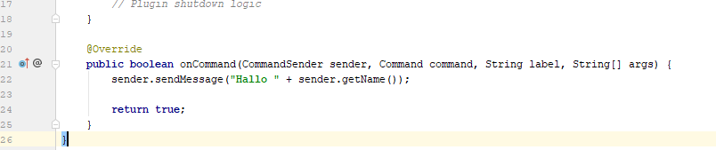

das Sieht dann in etwa so aus:

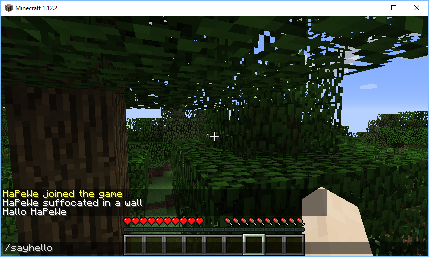